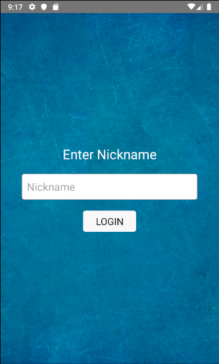
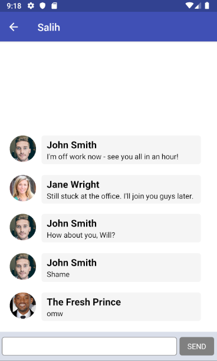
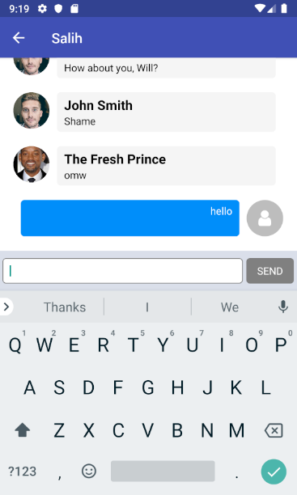

# MessagingApp

For install packages "yarn install" or "npm install"

For run app "yarn start-android" or "yarn start-ios"

# Task:
<h2>Story</h2>

The first screen of the app asks users for a nickname. When the continue button is tapped if provided nickname is longer than two characters then the messages screen is shown. If not, warn the user in a manner you see fit.

The second and last screen of the app contains user messages. Title of this screen is our own user's nickname. Previous messages are fetched from https://jsonblob.com/api/jsonBlob/4f421a10-5c4d-11e9-8840-0b16defc864d. When our user types a new message and sends it their message appears after the last sent message, aligned to the right hand side. If the new message is not within view, it should come into view with a scroll animation. There is also a leave button at the top left corner which when tapped takes the user to the first screen.

The app should persist user session data excluding message history. Meaning that if I log in using the nickname "John" and then quit the app, the next time I launch it I should see the second screen with "John" as the title.

 

You can use firebase.

<a href="https://www.shaketree.tk/">/</a>
<a href="https://www.shaketree.tk/">/</a>
<a href="https://www.shaketree.tk/">/</a>
